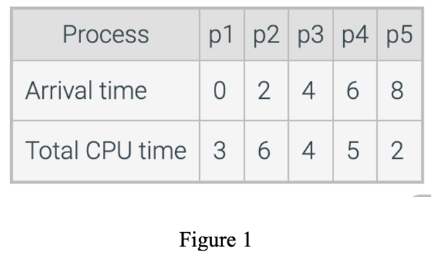
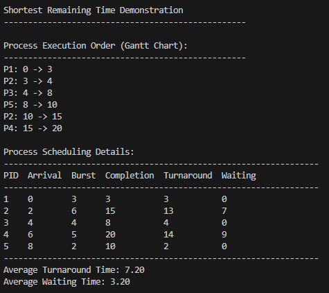
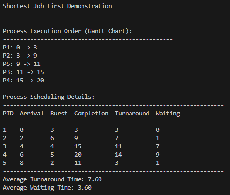
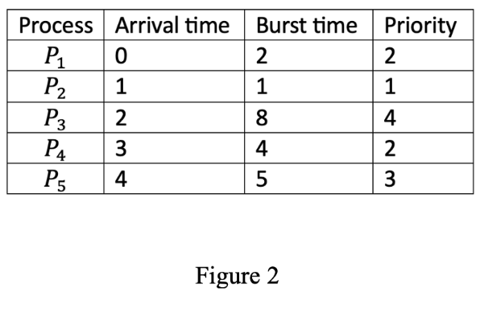
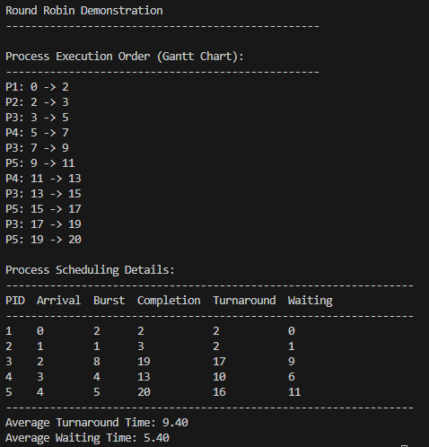

# Comp-Sci 431 CPU Scheduling
## Section 1: Outputs

This section includes the screenshots of the output from testing Shortest Remaining Time Scheduling Algorithm and Shortest Job First Scheduling Algorithm using the input provided by Figure 1. The output from testing Round Robin Scheduling Algorithm is using the input provided by Figure 2.

## Section 2: Implementation Details

While I was creating the code to represent the way that these scheduling algorithms handle processes, I drew a lot of inspiration from the code we developed together in class. However, I made a few changes that I think simplifies the code for me personally to understand. I am not a huge fan of having a bunch of helper functions to accomplish simple tasks, so I attempted to remove the helper functions and condense the code into its main scheduling loop.

The biggest challenge I had with using this implementation is how I thought about and used the Ready Queue. When processes were supposed to be added to the ready queue, when the ready queue was supposed to be sorted and when to remove processes were all challenges that I had to consider in the implementation process. Another challenge that I had was updating the Gantt Chart properly so it would display the information on process execution that was necessary. I stumbled over this a couple times as I have never used a Gantt Chart specifically and it was particularly difficult when implementing the Round Robin Scheduling Algorithm.

I overcame these challenges by creating a flow chart on my whiteboard that I thought would be an accurate representation of how the Algorithms should execute processes. I then used that to compare to the output I was getting from my code and make changes as necessary to reflect the correct information.

There were many valuable observations I made during the implementation process. One was reaffirming the effectiveness of white boarding a coding challenge. Having a reference to what you want your code to do before you actually try implementing the code is like having a lighthouse in the distance. You may not know how to get from where you are in the dark to the lighthouse, but it gives you a direction to head in. Another valuable insight is that when the code that you are writing continues to grow and grow it often becomes more difficult to read and understand. I found that separating each of the functions into their own files made reading, understanding, and debugging the code much simpler.
